import { Aside, Steps } from '@astrojs/starlight/components';
import { Tweet, Vimeo, YouTube } from 'astro-embed';

# Overview

You can use the Cantonese Fonts on your Apple iPad and iPhone.  There is no additional payment.

Installing custom fonts on Apple iOS requires a font management app (we suggest Fontinator as a free option).  After a quick installation, the Cantonese Fonts can be used with full features in any app that lets you choose the font.  This includes Pages and Keynote, but is exceptionally powerful when used in conjunction with note-taking apps like Good Notes or Notability, or Pencil-enabled art applications like Procreate.  This guide walks you through the installation and usage.

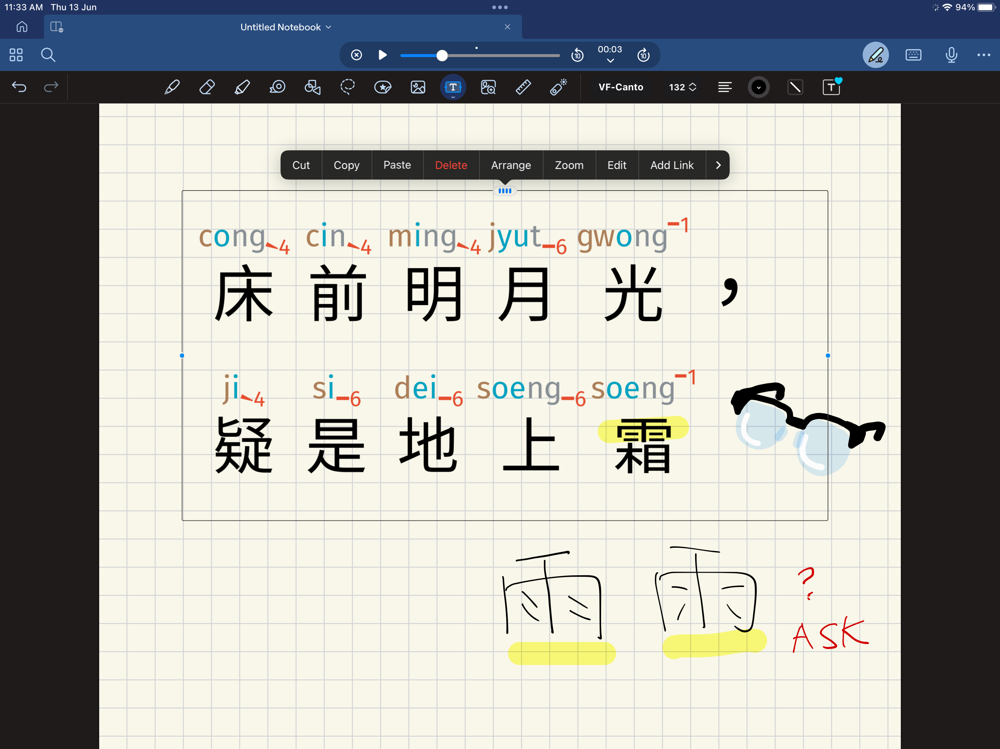

We refer to the device as "iPad" and the screens and videos show a ten-years old iPad running iOS 16.8.  The same procedures have also been tested on recent iPads as well as iPhones.

<Vimeo id="955099109" />

This 3 minutes video is a no-frills walkthrough of the installation and usage.

## Installation

Using a custom font in iOS is a four step process.  This takes about 3 minutes.

<Steps>
1. Get a font management app (free) from the App Store
2. Airdrop the Cantonese Font file to the iPad
3. Use the font management app to create a profile
4. Install the profile from the settings
</Steps>

### 1. Get Fontinator

There are many font management apps available on the App Store.  Fontinator is suggested here, as it is both free and supports older devices.  Search for Fontinator in your iPad App Store, and choose *Get* and then *Open*.

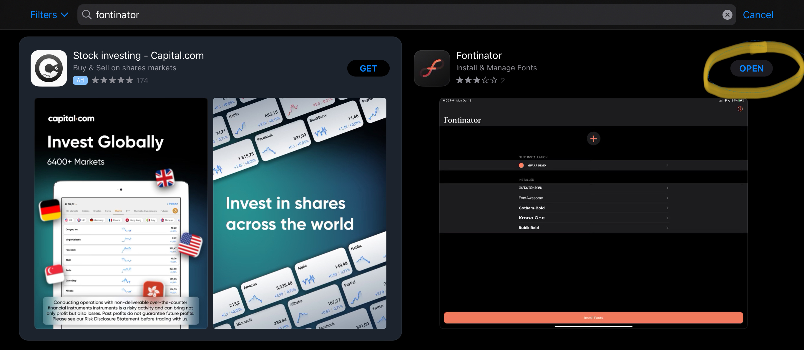

This will open a blank Fontinator window for Step 3.

### 2. Get Font File to iPad/iPhone

But first, you need to get the Cantonese Fonts to your iPad.  Go to where your `VF-Canto.ttf` is located, and choose *Share* then Airdrop.

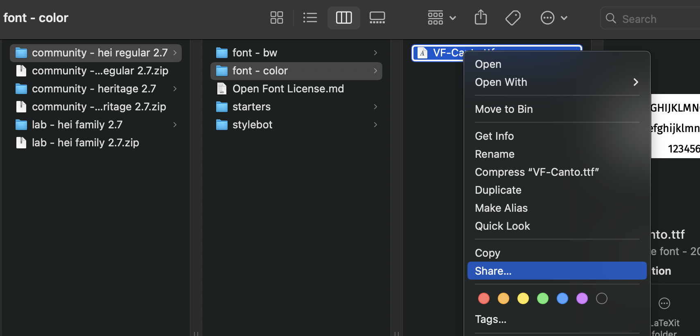

On your iPad, accept the drop *as a File*, 

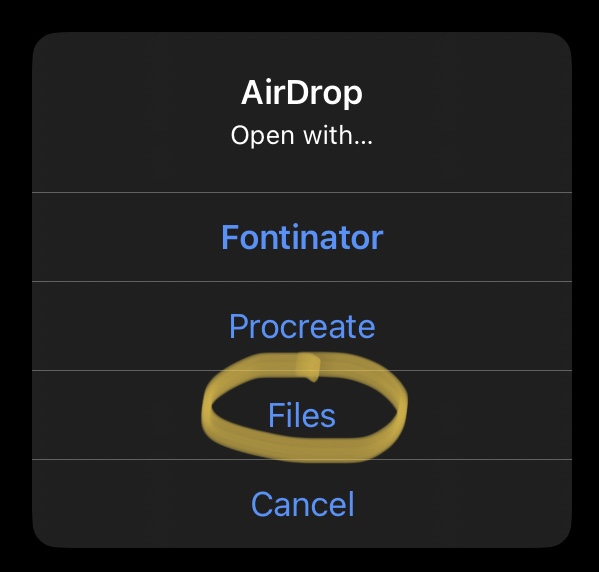

and choose save to iPad.

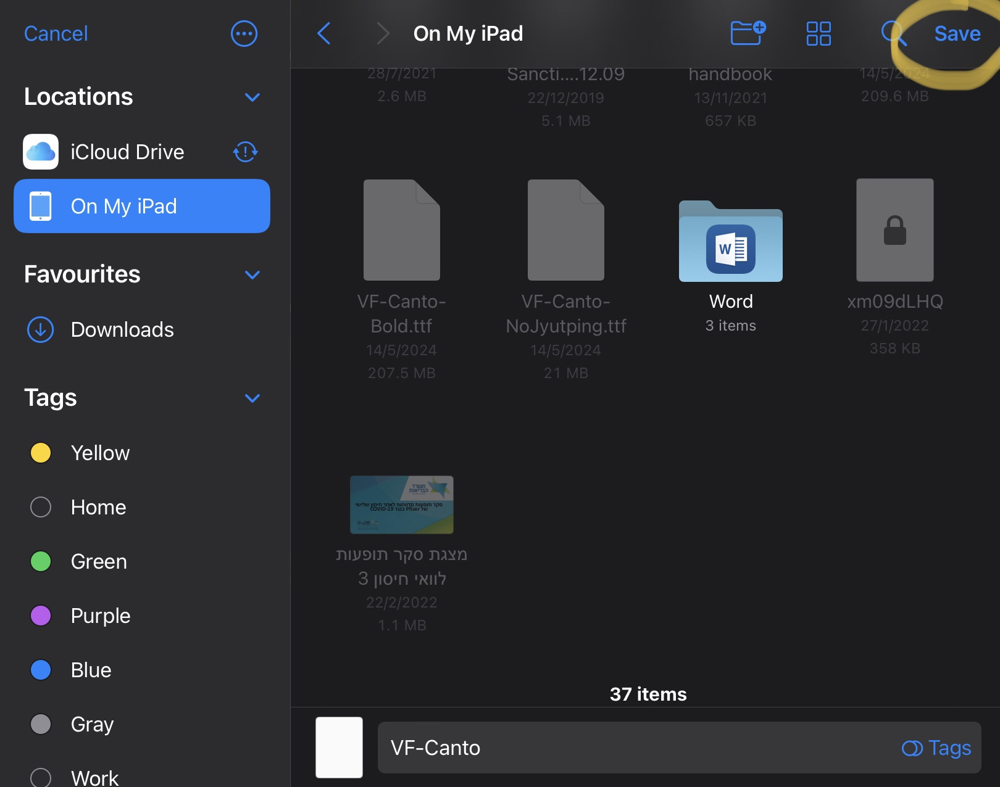

We can now go back to Fontinator.

### 3. Create font profile

In Fontinator, click the + button. Choose the `VF-Canto.ttf` that you had just saved, and click *Open*.

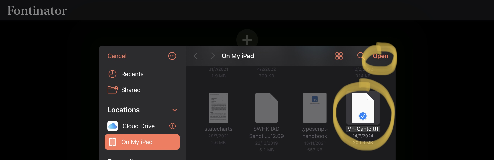

Click *Install Fonts* at the bottom of the screen, and wait for a few seconds.  A new popup appears:

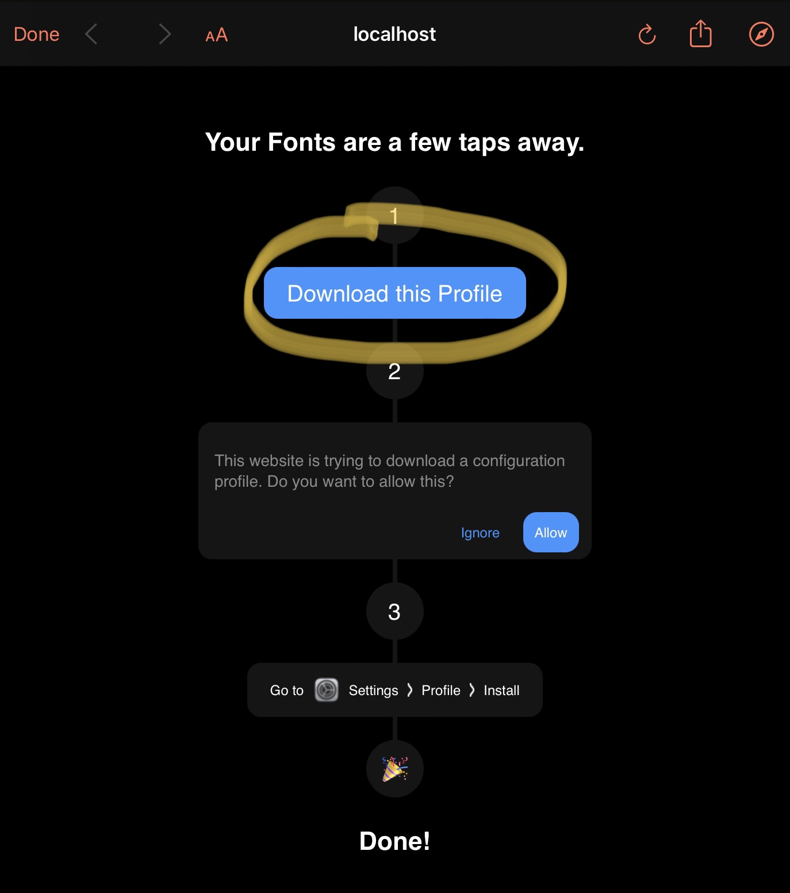

Save the profile, and your iPad will ask you to confirm.  Choose *Allow*.

You're almost there!

### 4. Activate font profile

To activate the font profile you've just created, go to *Settings*.

Choose *General* from the side-bar, then *VPN & Device Management*.

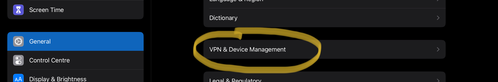

Click on *Fontinator Installation*, and then confirm.

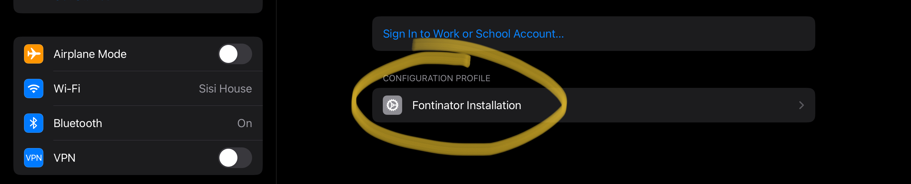

And that's it!  Let's now go test it out.  We'll use Pages for this, since it comes factory installed.

## Usage

In Pages, type or paste some Chinese text.  Then click the Paintbrush to choose formatting, then tap on *Fonts*:

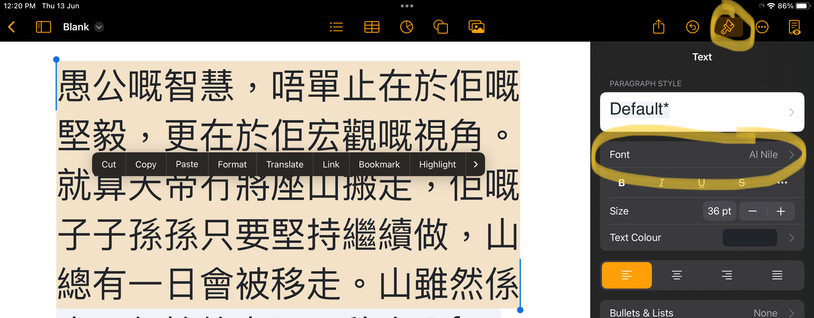

Scroll down to choose `VF Cantonese`, and your prose will now appear with Jyutping.

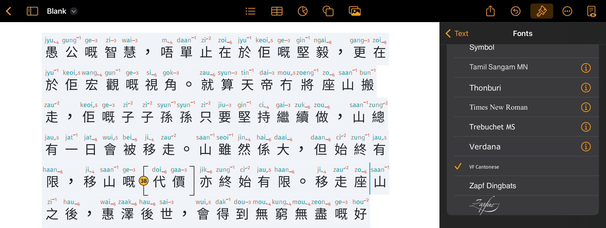

Similar procedures for changing fonts exists, and have been tested in Keynote (presentation), Numbers (spreadsheet), Good Notes / Notability (note-taking), and Procreate (drawing).
